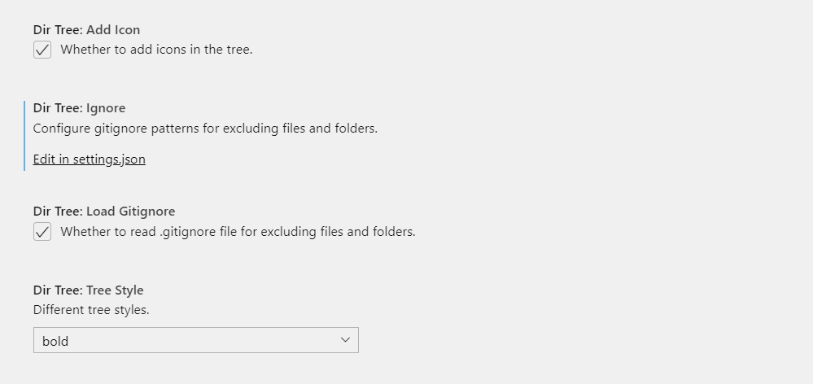

<h2 align="center"><br>Dir-tree</h2>

<p align = "center"><strong>A VS Code extension for generating directory tree.</strong></p>

## Features

Use it by right clicking on a folder：


<p align='center'><strong>Right click on a folder</strong></p>

Or entering `Generate directory tree` in the Command Palette：


<p align='center'><strong>Enter command in the Command Palette</strong></p>

You can：

- Exclude / include folders or files by clicking the checkbox on the side of the web panel.
- Hide / display icons of the tree by clicking the checkbox on the top of the tree text.


<p align='center'><strong>Use checkbox</strong></p>

## Extension Settings

<p align = "center"><strong>Settings</strong></p>



- Check **Add Icon** option when you wanna add icons in the tree.

- Check **Load Gitignore** option when you wanna exclude files and folders by `.gitignore` file.

- Use .gitignore pattern to edit **Ignore** config when you wanna exlude files or folders globally：

  ```json
  //settings.json
  "dirTree.ignore": [
      ".git/",
      "node_modules/",
      ".github/",
      "/.eslintrc.json",
      "/package-lock.json"
  ]
  ```

## Known Issues

It's slow when generating the tree for a directory with a amount of file, you need to wait for a while in this case.

## Change Log

[CHANGELOG.md](./CHANGELOG.md)

## Similar projects

[zhucyi/project-tree](https://github.com/zhucyi/project-tree)

[XboxYan/tree-generator](https://github.com/XboxYan/tree-generator)

*Note*：This extension is improved on the basis of [file-tree-generator ](https://marketplace.visualstudio.com/items?itemName=Shinotatwu-DS.file-tree-generator).

## License

MIT